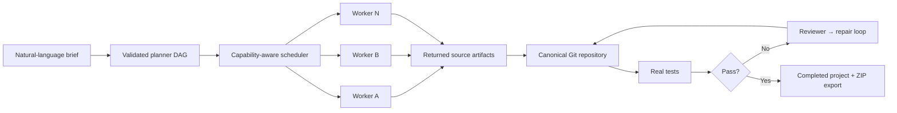
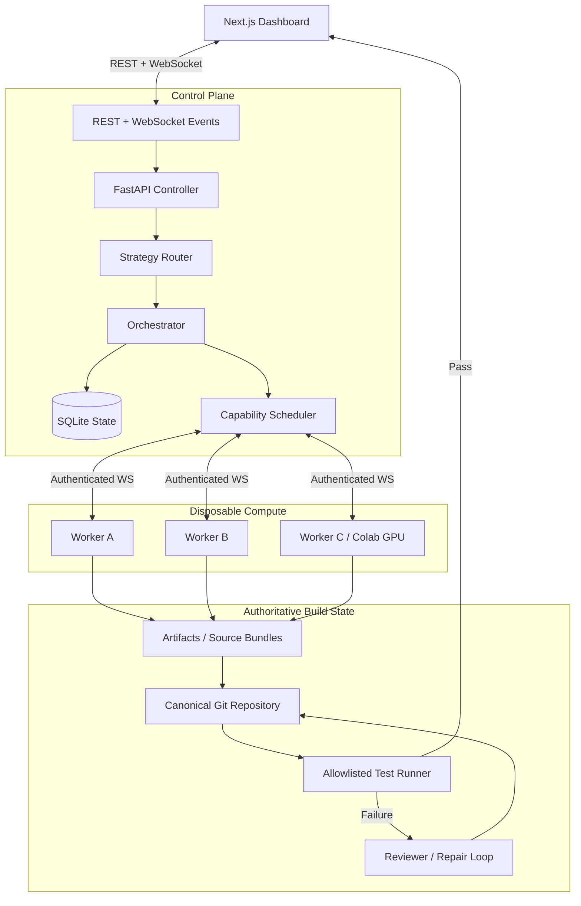
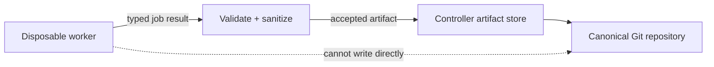
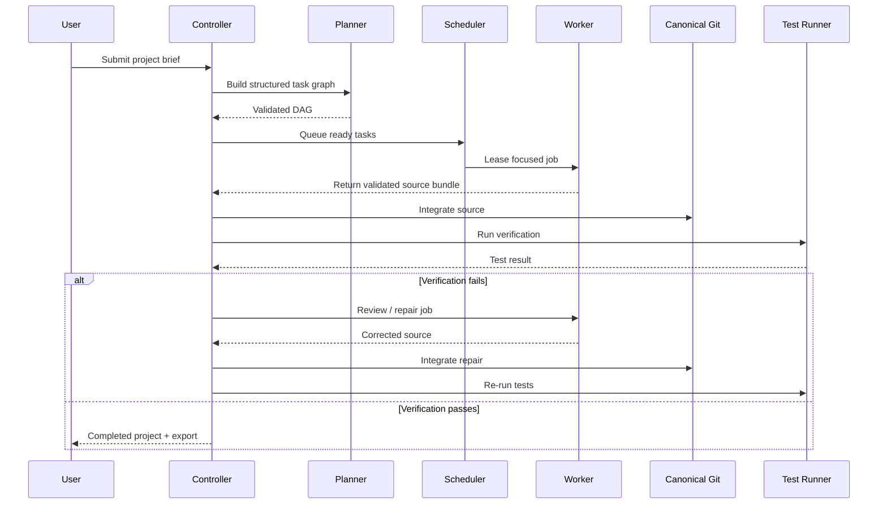
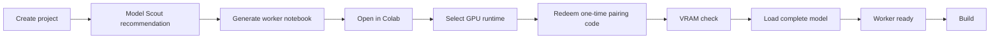
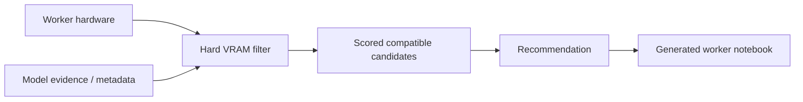
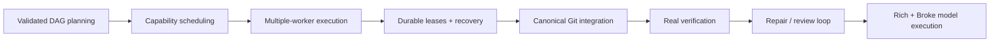

<div align="center">

# ⚡ AEGAEON

### Local-first AI coding & compute orchestration

Turn a natural-language software brief into a validated task graph, dispatch focused work to disposable workers, integrate source into a canonical Git repository, run real tests, and keep the entire build observable.

<br>


**Observable orchestration · Disposable workers · Canonical Git · Real verification**

</div>

---

## Overview

**AEGAEON** is a local-first AI coding and compute orchestration MVP.

It accepts a software brief, converts it into a validated DAG, assigns focused jobs to workers, collects returned source artifacts, integrates them into one authoritative Git repository, executes real verification, and records the complete build as project state.

The included deterministic demo can build and verify a **FastAPI calculator without an LLM or GPU**.

AEGAEON also supports two model-execution paths:

| Mode | Execution model | Best for |
|---|---|---|
| 💎 **Rich Boy** | Controller-side OpenAI-compatible provider | Fast setup with an available model endpoint |
| 🧃 **Broke Boy** | Disposable Colab/local GPU worker | Keeping inference on user-controlled compute |
| 🧪 **Demo** | Deterministic no-model runtime | Testing the full orchestration path without AI infrastructure |

> Project files do **not** depend on workers staying online. Workers operate in disposable directories and return artifacts; only the controller mutates the canonical repository.

---

## At a glance



### Core capabilities

| Area | Current MVP capability |
|---|---|
| 🧠 Planning | Strict Pydantic planner output with cycle-checked task DAGs |
| ⚙️ Scheduling | RAM, GPU, VRAM, model, and tool-aware worker matching |
| 🧵 Concurrency | Independent DAG tasks can dispatch across multiple workers |
| 🔁 Recovery | Durable job leases, controller-restart recovery, worker-loss requeue |
| 🤖 Agents | Planner, coder, failure reviewer, repair, and final-review agents |
| 📦 Artifacts | Checksum-addressed local artifact storage and source bundles |
| 🌿 Git | Conflict-aware integration into one canonical repository |
| ✅ Verification | Real `pytest` execution and reviewer/coder retry loops |
| 🔐 Worker trust | Authenticated workers, pairing codes, short-lived credentials |
| 🧭 Model selection | Evidence-backed Model Scout with VRAM filtering |
| 🖥️ UI | Next.js dashboard with live tasks, workers, files, attempts, and activity |
| 📤 Export | Repository ZIP export plus deterministic demo path |

---

## Architecture



### Trust boundary



Only the controller owns authoritative project state.

---

## Build lifecycle



---

## Execution modes

### 💎 Rich Boy

Uses a controller-side **OpenAI-compatible provider** and starts as soon as a compatible endpoint is configured.

Model mode drives:

- planning
- focused code generation
- verification-failure review
- repair
- final review

Provider failures remain visible and do **not** silently fall back to demo mode.

### 🧃 Broke Boy

Keeps inference on a disposable **Google Colab or local GPU worker**.

Typical flow:



The generated notebook:

- checks VRAM before downloading weights
- asks for a Hugging Face token only for gated models
- loads one complete model per worker
- returns validated source bundles only
- uses one-time pairing credentials stored hashed by the controller
- binds the resulting short-lived credential to the worker and model

See:

- [`docs/BROKE_BOY.md`](docs/BROKE_BOY.md)
- [`docs/MODEL_SCOUT.md`](docs/MODEL_SCOUT.md)

---

## Quick start

### Requirements

- **Python 3.11–3.13**
- **Node.js 20+**
- **npm**
- **Git**

### 1. Install

```powershell
cd AEGAEON

py -3.12 -m venv .venv
.\.venv\Scripts\Activate.ps1

python -m pip install -e ".[dev]"

Copy-Item .env.example .env

npm run install:web
```

### 2. Start the controller

```powershell
uvicorn apps.controller.main:app --reload
```

### 3. Start a worker

Open another terminal:

```powershell
python -m worker.worker `
  --controller ws://127.0.0.1:8000/ws/worker `
  --token development-token
```

Add more workers with unique IDs:

```powershell
python -m worker.worker `
  --controller ws://127.0.0.1:8000/ws/worker `
  --token development-token `
  --worker-id worker-local-two
```

### 4. Start the dashboard

Open a third terminal:

```powershell
npm run dev
```

Then open:

- **Dashboard:** `http://localhost:3000`
- **API docs:** `http://127.0.0.1:8000/docs`

Select **New project** → **Use demo brief**.

AEGAEON will:

1. create the planner DAG
2. dispatch implementation and test jobs
3. integrate generated Git patches
4. run the generated `pytest` suite
5. execute review
6. expose the final repository and ZIP export

---

## Docker Compose

```bash
cp .env.example .env
docker compose up --build
```

The Compose setup starts:

- the controller
- one disposable worker
- the web UI

Project data is retained in the `aegaeon-data` volume.

---

## Configure a model provider

AEGAEON's provider contract is vendor-neutral.

Any service exposing an OpenAI-compatible `/chat/completions` endpoint can be configured:

```dotenv
AEGAEON_DEMO_MODE=false
AEGAEON_LLM_BASE_URL=http://localhost:11434/v1
AEGAEON_LLM_API_KEY=
AEGAEON_LLM_MODEL=your-code-model
```

Restart the controller, open **Settings**, and use **Check connection**.

For structured-output and provider safety details, see:

[`docs/MODEL_PROVIDER.md`](docs/MODEL_PROVIDER.md)

---

## Model Scout

Model Scout helps match available hardware to compatible open models.



It supports:

- hardware-aware filtering
- VRAM requirements
- evidence-backed recommendations
- normalized Hugging Face metadata imports
- manual research imports

---

## Project data

```text
data/projects/project-xxxxxxxxxx/
├── repo/                 # authoritative Git repository
├── artifacts/            # source bundles, patches, test reports
├── logs/
├── project.json
└── AEGAEON/
    ├── plan.json
    ├── tasks.json
    └── history.json
```

SQLite is used for the MVP.

The SQLAlchemy boundary accepts another database URL, allowing a future PostgreSQL backend without changing orchestration services.

---

<details>
<summary><strong>🌐 API surface</strong></summary>

<br>

| Method | Endpoint | Purpose |
|---|---|---|
| `POST` | `/projects` | Create a canonical project workspace |
| `POST` | `/projects/{id}/run` | Start orchestration |
| `POST` | `/projects/{id}/cancel` | Cancel a run |
| `GET` | `/projects/{id}/tasks` | Inspect task state and retries |
| `GET` | `/projects/{id}/files` | List canonical files |
| `GET` | `/projects/{id}/export` | Download a repository ZIP |
| `GET` | `/projects/{id}/jobs` | Inspect durable leases, attempts, and reassignments |
| `GET` | `/workers` | Inspect worker hardware and load |
| `GET` | `/models` | Inspect the controller model registry |
| `POST` | `/model-scout/recommend` | Rank compatible open models from factual evidence |
| `POST` | `/model-scout/discover` | Import normalized Hugging Face metadata |
| `POST` | `/projects/{id}/workers/notebooks` | Generate secure disposable worker notebooks |
| `POST` | `/pairing/redeem` | Redeem a one-time code for a short-lived worker credential |
| `POST` | `/projects/{id}/research/prompt` | Generate a bounded manual research prompt |
| `POST` | `/projects/{id}/research/import` | Validate and persist advisor JSON |
| `GET` | `/provider/status` | Inspect safe model configuration metadata |
| `POST` | `/provider/check` | Probe the configured model endpoint |
| `WS` | `/ws/ui` | Stream observable control-plane events |
| `WS` | `/ws/worker` | Register workers and exchange typed jobs |

</details>

---

## Verification

Run the Python test suite:

```powershell
pytest
```

Run Ruff:

```powershell
ruff check aegaeon worker tests apps/controller
```

Build the web application:

```powershell
npm run build
```

The current test suite covers:

- Rich/Broke mode persistence
- Model Scout hardware filtering
- secure notebook generation
- one-time worker pairing
- typed model jobs
- mocked worker-hosted model builds
- worker registration and heartbeat state
- durable lease recovery
- atomic multi-worker reservation
- disconnect interruption
- concurrent Git integration and conflicts
- DAG readiness and cycle handling
- scheduling requirements
- strategy selection
- artifacts
- end-to-end single- and two-worker projects

---

## Security model

> [!WARNING]
> **AEGAEON executes generated code. The current MVP is not a hardened sandbox.**

Current controls include:

- execution restricted to managed project roots
- executable allowlists
- process timeouts
- output limits
- returned-path sanitization
- authenticated workers
- controller-owned canonical files
- one-time worker pairing
- bounded structured model job results

These controls reduce accidental exposure but are **not** a production-grade isolation boundary.

Run untrusted workloads only on isolated machines.

**Docker-backed execution is the planned production boundary.**

Never commit real API keys or worker tokens. Checked-in `.env.example` values are development-only.

---

## MVP status

### Implemented



The **ten-phase MVP** and **Rich Boy / Broke Boy continuation milestone** are complete.

### Next

```text
Docker-backed workload isolation
        ↓
PostgreSQL adapter
        ↓
Object-storage adapter
        ↓
Broader post-MVP orchestration strategies
```

Future / intentionally unavailable MVP routes include:

- swarm voting
- specialized multimodal pipelines
- custom workflow graphs
- distributed-model worker groups

Stable strategy/job concepts already represent these directions, but they are not exposed as active MVP workflows.

See [`docs/MULTI_WORKER.md`](docs/MULTI_WORKER.md) for Phase 10 operations and recovery behavior.

---

## Development status

AEGAEON is under active development.

The core orchestration pipeline, AI agents, worker system, scheduling, verification, Git integration, model execution workflows, dashboard, and multi-worker recovery behavior are functional, but the project is still moving toward a more robust production platform.

APIs, architecture, and implementation details may change as development continues.

---

## License

AEGAEON is released under the **Community Non-Commercial License v1.0**.

Permitted uses include personal, educational, academic, research, evaluation, hobby, and other **non-commercial** use, subject to the full license terms.

Commercial use — including commercial deployment, SaaS/hosted use, incorporation into paid products or services, paid customer services, and other commercial exploitation — requires prior written authorization or a separate commercial license from **Cyanex**.

See:

[`LICENSE`](LICENSE)

> Third-party components remain subject to their own licenses and terms.

---

<div align="center">

### AEGAEON

**From brief → task graph → disposable compute → canonical Git → verified project**

Built for observable, local-first AI software orchestration.

</div>
