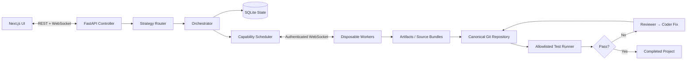

# AEGAEON

AEGAEON is a local-first AI coding and compute orchestration MVP. It turns a natural-language software brief into a validated task graph, assigns focused jobs to disposable workers, stores returned artifacts, integrates source into a canonical Git repository, runs real tests, and records the complete build as observable project state.

The included demo runtime can build and verify a FastAPI calculator without an LLM or GPU. A generic OpenAI-compatible provider powers **Rich Boy mode**. **Broke Boy mode** keeps inference on your own disposable Colab or local GPU worker using an evidence-selected open model.

## What works

- FastAPI control plane with SQLite persistence and typed REST/WebSocket protocols
- authenticated workers with hardware registration, utilization heartbeats, and reconnect behavior
- durable job leases with controller-restart recovery and worker-loss requeue
- capability-aware scheduling with RAM, GPU, VRAM, model, and tool requirements
- strict Pydantic planner output and cycle-checked task DAGs
- concurrent dispatch of independent DAG tasks across multiple workers
- model-driven planner, coder, failure reviewer, repair, and final-review agents
- disposable worker job directories and source-bundle artifacts
- conflict-aware canonical Git integration for concurrently generated source bundles
- checksum-addressed local artifact storage
- allowlisted, path-confined subprocess execution with timeout and output limits
- real pytest verification and reviewer/coder retry loop
- Rich Boy/Broke Boy project modes with secure worker pairing and generated Run-All Colab notebooks
- evidence-backed Model Scout with hard VRAM filtering, scored recommendations, and manual research imports
- typed worker-side `model.generate`/`model.repair` jobs with bounded structured source results
- polished Next.js dashboard with live task, worker, job-attempt, file, and activity views
- ZIP export and a deterministic no-model demo path

## Architecture



Project files never depend on a worker staying online. Workers use temporary directories and return artifacts; only the controller mutates the canonical repository.

## Quick start

Requirements: Python 3.11–3.13, Node.js 20+, npm, and Git.

```powershell
cd AEGAEON
py -3.12 -m venv .venv
.\.venv\Scripts\Activate.ps1
python -m pip install -e ".[dev]"
Copy-Item .env.example .env
npm run install:web
```

Start the controller:

```powershell
uvicorn apps.controller.main:app --reload
```

Start a worker in another terminal:

```powershell
python -m worker.worker `
  --controller ws://127.0.0.1:8000/ws/worker `
  --token development-token
```

Start additional workers with unique IDs to run independent DAG tasks concurrently:

```powershell
python -m worker.worker `
  --controller ws://127.0.0.1:8000/ws/worker `
  --token development-token `
  --worker-id worker-local-two
```

Start the web UI in a third terminal:

```powershell
npm run dev
```

Open [http://localhost:3000](http://localhost:3000), select **New project**, and choose **Use demo brief**. AEGAEON will produce the planner DAG, dispatch implementation and test jobs, integrate two Git patches, run the generated pytest suite, complete review, and expose the finished repository and ZIP export.

API documentation is available at [http://127.0.0.1:8000/docs](http://127.0.0.1:8000/docs).

### Docker Compose

```bash
cp .env.example .env
docker compose up --build
```

The Compose setup starts the controller, one disposable worker, and the web UI. Project data is retained in the `aegaeon-data` volume.

## Choose an execution mode

**Rich Boy** uses the controller-side OpenAI-compatible provider and starts immediately. Existing demo and provider behavior remain unchanged.

**Broke Boy** makes no controller-side paid model calls. Create the project, review the Model Scout recommendation, generate the worker notebooks, then:

1. Download each `.ipynb` and open it in Google Colab.
2. Select a GPU runtime and run all cells.
3. Enter the one-time pairing code shown by AEGAEON.
4. Wait until the project reports a compatible model worker as ready, then select **Build**.

The notebook checks VRAM before downloading weights, requests a Hugging Face token only for gated models, loads one complete model per worker, and returns only validated source bundles. Pairing codes are stored hashed, expire, can be redeemed once, and issue a short-lived credential bound to the worker and model. See [Broke Boy operations](docs/BROKE_BOY.md) and [Model Scout](docs/MODEL_SCOUT.md).

## Configure a model provider

AEGAEON's provider contract is vendor-neutral. Configure any service exposing an OpenAI-compatible `/chat/completions` endpoint:

```dotenv
AEGAEON_DEMO_MODE=false
AEGAEON_LLM_BASE_URL=http://localhost:11434/v1
AEGAEON_LLM_API_KEY=
AEGAEON_LLM_MODEL=your-code-model
```

Restart the controller, open **Settings**, and use **Check connection**. Model mode drives
planning, focused code generation, verification-failure review and repair, and final review.
Provider errors remain visible and never silently fall back to demo mode. See
[Model provider runtime](docs/MODEL_PROVIDER.md) for structured-output and safety details.

## Data layout

```text
data/projects/project-xxxxxxxxxx/
├── repo/                 # authoritative Git repository
├── artifacts/            # source bundles, patches, test reports
├── logs/
├── project.json
└── AEGAEON/
    ├── plan.json
    ├── tasks.json
    └── history.json
```

SQLite is used for the MVP. The SQLAlchemy database boundary accepts another URL so PostgreSQL can replace it without changing orchestration services.

## API surface

| Method | Endpoint | Purpose |
|---|---|---|
| `POST` | `/projects` | Create a canonical project workspace |
| `POST` | `/projects/{id}/run` | Start orchestration |
| `POST` | `/projects/{id}/cancel` | Cancel a run |
| `GET` | `/projects/{id}/tasks` | Inspect task state and retries |
| `GET` | `/projects/{id}/files` | List canonical files |
| `GET` | `/projects/{id}/export` | Download a repository ZIP |
| `GET` | `/projects/{id}/jobs` | Inspect durable leases, attempts, and reassignments |
| `GET` | `/workers` | Inspect worker hardware and load |
| `GET` | `/models` | Inspect the controller model registry |
| `POST` | `/model-scout/recommend` | Rank compatible open models from factual evidence |
| `POST` | `/model-scout/discover` | Import normalized Hugging Face metadata |
| `POST` | `/projects/{id}/workers/notebooks` | Generate secure disposable worker notebooks |
| `POST` | `/pairing/redeem` | Redeem a one-time code for a short-lived worker credential |
| `POST` | `/projects/{id}/research/prompt` | Generate a bounded manual research prompt |
| `POST` | `/projects/{id}/research/import` | Validate and persist advisor JSON |
| `GET` | `/provider/status` | Inspect safe model configuration metadata |
| `POST` | `/provider/check` | Probe the configured model endpoint |
| `WS` | `/ws/ui` | Stream observable control-plane events |
| `WS` | `/ws/worker` | Register workers and exchange typed jobs |

## Tests

```powershell
pytest
ruff check aegaeon worker tests apps/controller
npm run build
```

The Python suite covers Rich/Broke mode persistence, Model Scout hardware filtering, secure notebook generation, one-time pairing, typed model jobs, a full mocked worker-hosted model build, worker registration and heartbeat state, durable lease recovery, atomic multi-worker reservation, disconnect interruption, concurrent Git integration and conflicts, DAG readiness and cycles, scheduling requirements, strategy selection, artifacts, and end-to-end single- and two-worker projects.

## Security warning

AEGAEON executes generated code. The MVP restricts execution to managed project roots, allowlists executables, applies timeouts and output limits, sanitizes returned paths, authenticates workers, and prevents workers from directly writing controller files. These controls reduce accidental exposure but are **not a hardened sandbox**. Run untrusted workloads only on isolated machines. A Docker-backed executor is the planned production boundary.

Never commit real API keys or worker tokens. The checked-in `.env.example` contains development-only values.

## Limitations and roadmap

- Strategy 1 (single model / multi-agent) is the implemented route.
- Swarm voting, specialized multimodal pipelines, custom workflow graphs, and distributed-model worker groups are represented by stable strategy/job concepts but are intentionally unavailable in the MVP UI.
- Durable multiple-worker scheduling, restart recovery, bounded requeue, and conflict-aware integration are implemented.
- The deterministic demo remains available for no-model evaluation; model mode supports free-form, validated source generation.
- Local subprocess execution is development-only; Docker sandboxing is next.
- PostgreSQL and object-storage adapters are future replacements for SQLite and local artifacts.

The ten-phase MVP and the Rich Boy/Broke Boy continuation milestone are complete. The next post-MVP milestone is Docker-backed execution and stronger workload isolation, followed by PostgreSQL/object-storage adapters. See [Multiple-worker execution](docs/MULTI_WORKER.md) for Phase 10 operations and recovery behavior.

#
